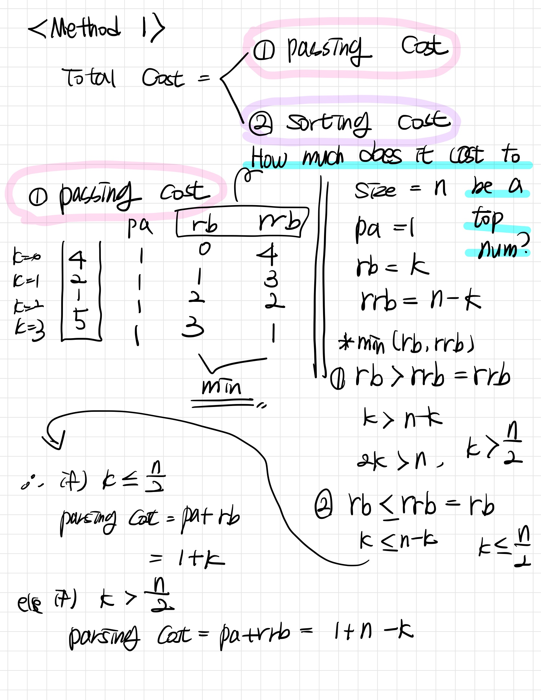
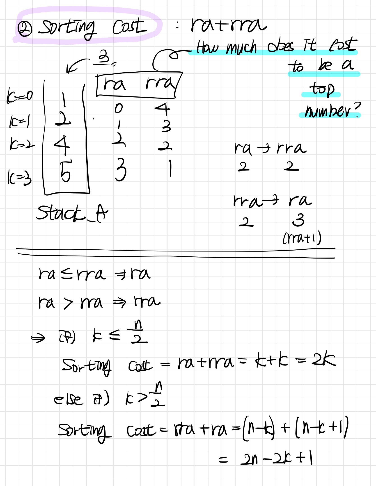
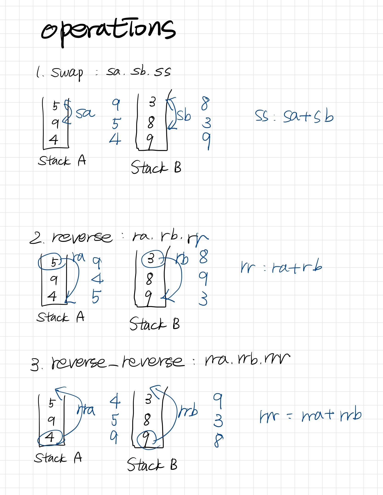
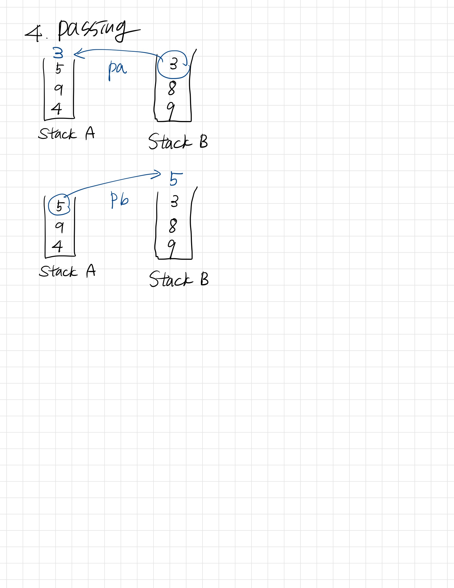

# Push_swap
### what to study
- Decide which of several data structures to use: array stack, linked stack, doubly linked stack, circular stack
- Compare and choose one of several sorting algorithms: merge sort, quick sort, greedy

### Mandatory part
The game consists of 2 stacks, called a and b
  
Stack a : receives int numbers, no duplication  
Stack b : empty  

goal : sort numbers in ascending order into stack a  

## Sort by Greedy
A greedy algorithm is a type of algorithm that makes locally optimal choices at each step in the hope of finding a global optimum solution. In the context of sorting algorithms, a greedy approach can involve calculating the cost of each node to the sorting stack and choosing the best action based on that cost.  

To implement this approach, you can first move every node in the unsorted list to a second stack called stack_b. However, if you have a standard (pivot number), you can categorize the numbers into different groups. For example, let's say you have two pivot numbers - a small pivot that represents the smallest one-third of the numbers, and a large pivot that represents the largest two-thirds of the numbers.  

1. Pass the numbers that are larger than the big pivot to another stack (stack_b).
2. If a number is smaller than the small pivot, move it to the bottom of the original stack (stack_a).
3. Once you've completed this process, you'll have three parts of the numbers: the ones that are bigger than the big pivot in stack_a, the ones that are smaller than the small pivot but bigger than the big pivot at the top of stack_b, and the ones that are smaller than the small pivot at the bottom of stack_b.
4. Finally, move the numbers from stack_a to stack_b. Now you'll have three parts of the numbers in stack_b - the ones that are larger than the big pivot, the ones that are between the big and small pivots, and the ones that are smaller than the small pivot.
This approach divides the numbers into three groups based on their size relative to the two pivot numbers. By doing this, you can reduce the number of comparisons required to sort the list, and the algorithm becomes more efficient.

```c
void	push_swap(t_stack *stack_a, t_stack *stack_b)
{
	get_pivot(stack_a);
	move_small_and_middle_to_b(stack_a, stack_b);
	move_big_to_b(stack_a, stack_b);
	display_two_stack(stack_a, stack_b);
}
```

1. get pivot
```c
void	get_pivot(t_stack *stack)
{
	int	*arr;
	int	size;
	int	small_pivot_idx;
	int	large_pivot_idx;
	int	range;

	size = stack_size(stack);
	if (is_stack_empty(stack) || size == 1)
		return ;
	arr = (int *)malloc(size * sizeof(int));
	if (!arr)
		exit(1);
	stack_to_array(stack, arr, size);
	quicksort(arr, 0, size - 1);
	range = size / 3;
	small_pivot_idx = range - 1;
	large_pivot_idx = range * 2 - 1;
	if (size % 3 == 2)
		large_pivot_idx++;
	stack->small_pivot = arr[small_pivot_idx];
	stack->large_pivot = arr[large_pivot_idx];
	free(arr);
}
```
2. using pivot, split stack
```c
static void move_small_and_middle_to_b(t_stack *stack_a, t_stack *stack_b)
{
	t_stack_node	*dummy;
	size_t			size;
	
	size = stack_a->size;
	dummy = stack_a->top;
	while (dummy != NULL && size)
	{
		if (stack_a->big_pivot >= dummy->data)
		{
			dummy = dummy->prev;
			pb(stack_a, stack_b);
			if (stack_b->top->data <= stack_a->small_pivot)
				rb(stack_b);
			size--;
		}
		else
		{
			dummy = dummy->prev;
			ra(stack_a);
			size--;
		}
	}
}

static void	move_big_to_b(t_stack *stack_a, t_stack *stack_b)
{
	t_stack_node	*dummy;
	
	dummy = stack_a->top;
	while (dummy != NULL)
	{
		pb(stack_a, stack_b);
		dummy = dummy->prev;
	}
}
```
3. sort by greedy
The purpose of this step is to calculate each node of stack_b for sorting stack_a, and select the node that has the minimum cost to pass it to stack_a.  

To calculate the cost, there are two parts: The first is cost of passing the selected node from stack_b to stack_a. "pa" operation always has a cost of 1, and "rb" operation is zero at the top and increases by 1 towards the bottom, since we need to move the node further down the stack. Similarly, "rrb" operation is zero at the bottom and increases by 1 towards the top. Therefore, the total cost of passing the selected node is 1 + min(rb, rrb).  

The second is the cost of sorting stack_a. It is calculated differently for method 1 and method 2.  

  
 


## Functions before sorting
1. fill_stack.c
```c
int	fill_stack(t_stack *stack_a, int argc, char **argv)
{
	int	i;

	i = 1;
	while (i < argc)
	{
		if (valid_args(argv[i], stack_a) == ERROR)
		{
			destroy_stack(&stack_a);
			return (ERROR);
		}
		i++;
	}
	return (0);
}
```

```c
int	valid_args(char *av, t_stack *stack_a)
{
	long long	data;
	char		**numbers;
	int			i;

	if (av == NULL)
		return (error_return("Error\n", ERROR));
	i = 0;
	numbers = ft_split(av, ' ');
	if (!numbers)
		error_exit(stack_a, NULL);
	while (numbers[i])
	{
		if (is_number(numbers[i]) == ERROR)
			error_exit(stack_a, NULL);
		data = ft_atoi_extension(numbers[i]);
		if (is_int(data) == ERROR)
			error_exit(stack_a, NULL);
		if (check_duplicate(stack_a, (int)data) == ERROR)
			error_exit(stack_a, NULL);
		push(stack_a, (int)data);
		i++;
	}
	free_two_dementional_array(numbers);
	return (0);
}
```

2. operations.c
  

### sa, sb, ss
```c
static void	swap(t_stack *list)
{
	int	temp;

	if (list->top && list->top->prev)
	{
		temp = list->top->data;
		list->top->data = list->top->prev->data;
		list->top->prev->data = temp;
	}
}
```
```c
void	sa(t_stack *stack_a)
{
	swap(stack_a);
	ft_printf("sa\n");
}

void	sb(t_stack *stack_b)
{
	swap(stack_b);
	ft_printf("sb\n");
}

void	ss(t_stack *stack_a, t_stack *stack_b)
{
	swap(stack_a);
	swap(stack_b);
	ft_printf("ss\n");
}
```

### ra, rb, rr
```c
static void	rotate(t_stack *list)
{
	t_stack_node	*head;
	t_stack_node	*top;

	if (list == NULL || list->head == NULL || list->head->next == NULL)
		return ;
	head = list->head;
	top = list->top;
	top->next = head;
	head->prev = top;
	list->head = top;
	list->top = top->prev;
	list->top->next = NULL;
	list->head->prev = NULL;
}
```
```c
void	ra(t_stack *stack_a)
{
	rotate(stack_a);
	ft_printf("ra\n");
}

void	rb(t_stack *stack_b)
{
	rotate(stack_b);
	ft_printf("rb\n");
}

void	rr(t_stack *stack_a, t_stack *stack_b)
{
	rotate(stack_a);
	rotate(stack_b);
	ft_printf("rr\n");
}
```

### rra, rrb, rrr
```c
static void	reverse_rotate(t_stack *list)
{
	t_stack_node	*head;
	t_stack_node	*top;

	if (list == NULL || list->head == NULL || list->head->next == NULL)
		return ;
	head = list->head;
	top = list->top;
	top->next = head;
	head->prev = top;
	list->top = head;
	list->head = head->next;
	list->top->next = NULL;
	list->head->prev = NULL;
}
```
```c
void	rra(t_stack *stack_a)
{
	reverse_rotate(stack_a);
	ft_printf("rra\n");
}

void	rrb(t_stack *stack_b)
{
	reverse_rotate(stack_b);
	ft_printf("rrb\n");
}

void	rrr(t_stack *stack_a, t_stack *stack_b)
{
	reverse_rotate(stack_a);
	reverse_rotate(stack_b);
	ft_printf("rrr\n");
}
```



```c
static void	push_to(t_stack *from, t_stack *to)
{
	int	data;

	if (from->top)
	{
		data = pop(from);
		push(to, data);
	}
}

void	pa(t_stack *stack_a, t_stack *stack_b)
{
	push_to(stack_b, stack_a);
	ft_printf("pa\n");
}

void	pb(t_stack *stack_a, t_stack *stack_b)
{
	push_to(stack_a, stack_b);
	ft_printf("pb\n");
}
```